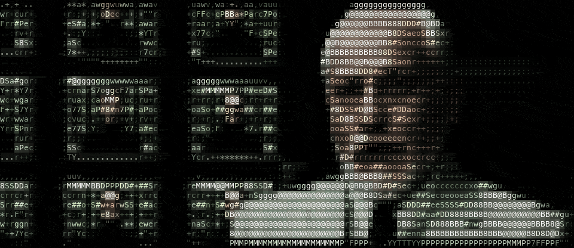

# auto-ascii

Turn any video into realtime ASCII-art. 

An offline **factory** distills a video into a resolution-independent feature
asset (`.ascii`). The asset holds luma, edge magnitude and orientation,
highlights and chroma. A runtime **player** maps that asset
onto whatever cell grid you have. It picks glyph ramps, directional
edge strokes, highlights and half-blocks, letterboxes to the video's aspect,
reflows live on resize, and applies temporal hysteresis so nothing flickers.
Because every glyph is chosen at render time, one asset looks right at 80×24
in a Linux console, at 320×90 in a GPU terminal, and inside your own renderer.



One command, `auto-ascii`, imports, plays, streams and stitches video, and
keeps your clips in a library folder. It runs ffmpeg as a subprocess and links
no video codecs. The `auto-ascii` library crate behind it renders onto any
cell grid you own.

## Install

You need a recent stable Rust toolchain (edition 2024). macOS and Linux build
from source.

```bash
git clone https://github.com/andmckay01/auto-ascii && cd auto-ascii
cargo install --path crates/auto-ascii-cli       # the auto-ascii command
```

`add` and `import` need `ffmpeg` and `ffprobe`; links also need `yt-dlp`. If
one is not on `PATH`, the CLI offers once to download a checksum-verified build
into its cache (`--yes` skips the question; `auto-ascii doctor` shows what it
found), or `brew install ffmpeg yt-dlp`. Playing needs none, except for sound.

## Use

```bash
auto-ascii add "https://youtu.be/jNQXAC9IVRw"   # a YouTube link -> library/me-at-the-zoo/
auto-ascii add ~/Movies/clip.mp4                # an mp4 -> library/clip/
auto-ascii add trip.mov --title "Road Trip"     # any video ffmpeg reads (.mov, .mkv, ...)
auto-ascii play me-at-the-zoo                   # q quits; or open its play.command
auto-ascii stream me at the zoo                 # play the first result live, saving nothing

auto-ascii list                             # what the library holds
auto-ascii cut clip --in 0:01 --out 0:04    # -> library/clip-0m01s-0m04s.ascii
auto-ascii compose new demo                 # -> compositions/demo.toml
auto-ascii compose add demo clip --at 0:10  # black until 0:10, then the clip
auto-ascii compose play demo                # compose export demo flattens it to exports/demo.ascii

auto-ascii import in.mp4 -o in.ascii        # just the asset, anywhere
auto-ascii play in.ascii --loop --seek 1:30 --style letters
```

`add` gives each clip a folder named after its title: `<Title>.ascii` (480×270,
30 fps), its soundtrack `<Title>.m4a`, a `play.command` launcher, logs and, for
a link, `source.mp4` (up to 1080p, never your browser cookies), all checked for
integrity and length. `play` uses a soundtrack beside any asset (`clip.m4a`,
`clip.mp4` or another container, then the folder's `source.mp4`) if its length
matches. `--mute` starts silent; `--no-audio` skips it.

The library is `~/auto-ascii` (`AUTO_ASCII_HOME` overrides it). `auto-ascii
--help` lists the everyday commands, `--help-all` every command and flag;
`play --help-all` shows the advanced player flags. Every command except the
interactive ones takes `--json`.

## Keys

| key | does |
|---|---|
| `q` / `Esc` / Ctrl-C | quit |
| space | pause / resume |
| `0`–`9` | jump to 0%–90% |
| `←` / `→` | seek back / forward 5 s |
| `/` | cycle the glyph style: `ascii` (default) → `pixels` → `letters` |
| `d`, then `[` / `]` | pick a dial (shadow lift, edge strength, hysteresis) and turn it |
| `s` | save this video's dials and style beside it as `<name>.player.toml` |
| `m` | sound on / off |
| `v` | hide / show the controls overlay |

`ascii` draws with printable ASCII only, `letters` adds blocks where the
picture is lit, and `pixels` paints a low-resolution picture from shade ramps
and half-blocks. Zoom your terminal out for a sharper picture: more cells, more
detail. While it plays, the player sets the terminal background black and
resets it on exit (`--no-backdrop` keeps yours). `play` exits 0 at the end, 3
when you quit and 1 on an error.

## Embedding

```rust
auto_ascii::Player::builder().asset("intro.ascii").looping(true).build()?.run()?;
```

That one call is the whole player. If you own the event loop and the output
layer, the terminal-free `RenderSession` hands you a grid of glyphs and RGB
colors per frame, and `default-features = false` drops clap and crossterm.
[crates/auto-ascii](crates/auto-ascii/README.md) lists the feature tiers and
the three runnable examples.

```toml
auto-ascii = "0.2"
```

## Docs

- [docs/FEATURE-MAP.md](docs/FEATURE-MAP.md): every feature and exactly how
  the pipeline works, with code pointers: glyph styles (§5), keys (§8), dials
  and saved settings (§9), the CLI and the library folder (§12), embedding
  (§13), headless rendering (§14), sound (§16), streaming (§17), the media
  tools and their download (§18).
- [docs/AGENT-GUIDE.md](docs/AGENT-GUIDE.md): the CLI for agents, the JSON
  shapes and the composition schema (also printed by `auto-ascii agent-guide`).
- [CONTRIBUTING.md](CONTRIBUTING.md): build, the gate, the determinism rules,
  the crate layout, release builds and publishing.
- [docs/HYSTERESIS-DECISION.md](docs/HYSTERESIS-DECISION.md): the hysteresis
  measurements behind the default.
- [docs/TERMINAL-CHECKLIST.md](docs/TERMINAL-CHECKLIST.md): the manual
  per-terminal pass.
- [docs/PLAN.md](docs/PLAN.md) and [docs/PLAN-M6-M8.md](docs/PLAN-M6-M8.md):
  the original designs; [docs/INTERFACES.md](docs/INTERFACES.md): the internal
  API registry; [docs/NOTES.md](docs/NOTES.md): domain and technology facts;
  [docs/research/](docs/research/): the research digests.

## License

[MIT](LICENSE). Unless you explicitly state otherwise, any contribution
intentionally submitted for inclusion in this project shall be licensed the
same way, without any additional terms or conditions.
